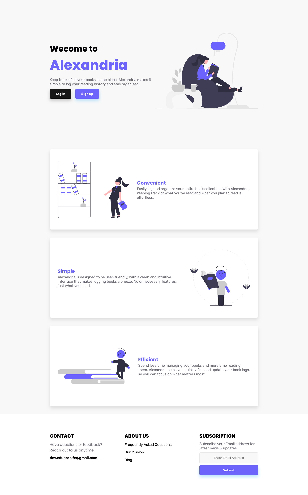
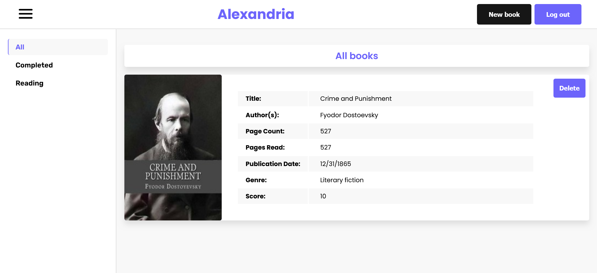

### Alexandria library frontend

This is the front for my library project. It's built with React and Sass. It uses RTK Query to handle the requests to the backend.

You can find the backend for this project [here](https://github.com/eddydevfe/library-backend).

